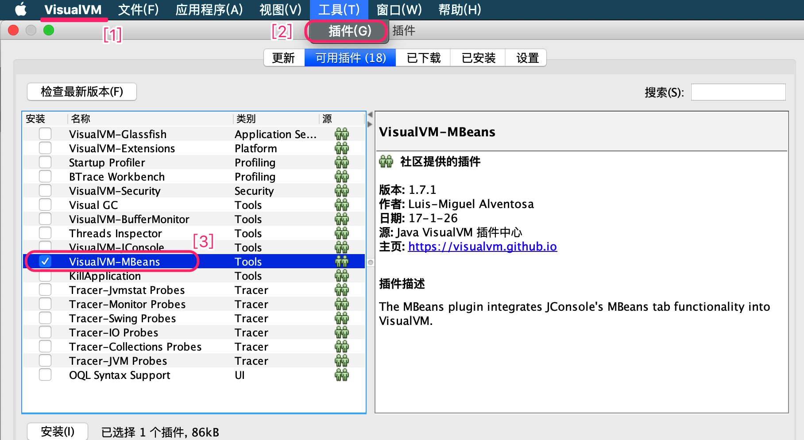
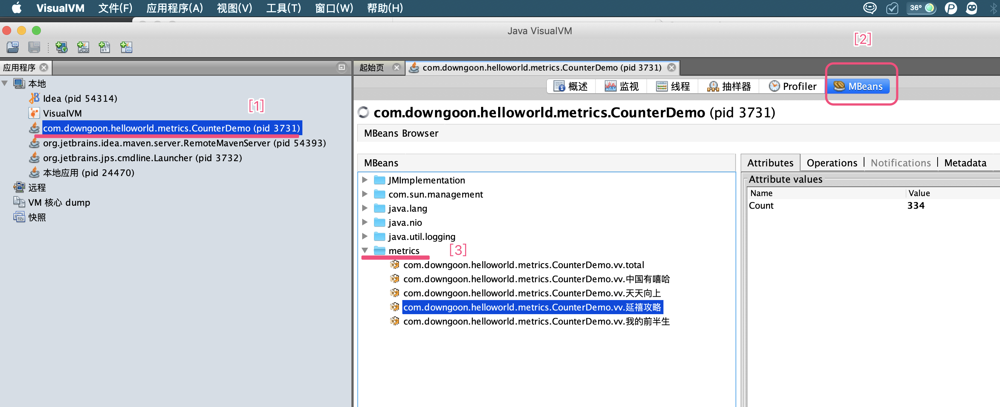

# Counter 计数器应用

<!-- MDTOC maxdepth:6 firsth1:1 numbering:0 flatten:0 bullets:1 updateOnSave:1 -->

- [Counter 计数器应用](#counter-计数器应用)   
   - [应用场景](#应用场景)   
   - [metrics的并发计数器](#metrics的并发计数器)   
   - [应用举例](#应用举例)   
   - [换其他形式报表？](#换其他形式报表？)   

<!-- /MDTOC -->

## 应用场景

``并发技术器``的应用场景很多，比如视频播放量统计。再比如广告领域的频次控制、广告领域的预算控制、电商领域的运费减免额度控制。


上面说的视频播放量统计，实际上是维护了：videoId —> VideoView 的映射关系。其中有两个并发控制点：

1. 当videoId不为空时，找到对应的Value，这个Value应该是``AtomicLong``类型。
2. 当videoId为空时，我们应该执行``hashMap.put(videoId, new AtomicLong(1))``。但是谁能保证，put操作时，恰恰这个时候被其他线程抢先put了呢？


形如：

``` java

AtomicLong counter = hashMap.get($videoId);
if (counter != null) {
   counter.increase();

} else {
  hashMap.put($videoId, new AtomicLong(1)); // 此时可能被其他线程抢先了
}
```


解决的办法无外乎两种：

- **悲观锁**： 在整个外面，加一个锁，不允许并发访问这个区域。
- **乐观锁**： 依然直接put，只不过如果万一put的时候，出了问题(发生被其他线程抢占)，那个put方法得告诉我发生冲突了。然后我们能修正这种冲突。


在 [mydk#ConcurrentCounter.java](https://github.com/downgoon/mydk/blob/master/src/main/java/xyz/downgoon/mydk/concurrent/ConcurrentCounter.java) 实现了这个并发计数器：


``` java

private ConcurrentHashMap<String, AtomicLong> map = new ConcurrentHashMap<String, AtomicLong>();

@Override
public Long increaseAndGet(String key, int delta) {
		AtomicLong c = map.get(key);
		if (c == null) {
					c = new AtomicLong(0L);
          AtomicLong pre = map.putIfAbsent(key, c); // putIfAbsent
          if (pre != null) {  // 冲突的时候，能够反馈出来
               c = pre;
         	}
     }
		return c.addAndGet(delta);
}
```


它的使用 [mydk#ConcurrentCounterTest.java](https://github.com/downgoon/mydk/blob/master/src/test/java/xyz/downgoon/mydk/concurrent/ConcurrentCounterTest.java) 代码：

``` java

ConcurrentCounter cnt = new ConcurrentCounter();
long bj = cnt.increaseAndGet("beijing", 10);
long sh = cnt.increaseAndGet("shanghai");

Assert.assertEquals(10, bj);
Assert.assertEquals(1, sh);

bj = cnt.decreaseAndGet("beijing", 2);
sh = cnt.decreaseAndGet("shanghai");

Assert.assertEquals(8, bj);
Assert.assertEquals(0, sh);

```


我们发现，并发计数和计数器容器没有解耦？好像融为一体了。

我们还发现，这些东西在``metrics``里面已经实现了。


## metrics的并发计数器

先引用开发包：

``` xml

<dependency>
		<groupId>io.dropwizard.metrics</groupId>
		<artifactId>metrics-core</artifactId>
		<version>3.1.2</version>
</dependency>

```


获取并发计数器：

``` java


MetricRegistry metricRegistry = new MetricRegistry();

String totalKey = MetricRegistry.name(CounterDemo.class, "vv", "total");

// get or add counter for the specified name
Counter totalView = metricRegistry.counter(totalKey);

// 并发计数
totalView.inc();
```


原来``metrics``全给实现了。我们看下它的源代码：


``` java

public Counter counter(String name) {
  	// get or add
		return (Counter)this.getOrAdd(name, MetricRegistry.MetricBuilder.COUNTERS);
}


private <T extends Metric> T getOrAdd(String name, MetricRegistry.MetricBuilder<T> builder) {
    Metric metric = (Metric)this.metrics.get(name);
    if (builder.isInstance(metric)) {
            return metric;
     } else {
          if (metric == null) {
             	try {
                    // 注册的时候，可能就被其他线程抢先注册了
                		return this.register(name, builder.newMetric());
                } catch (IllegalArgumentException var6) {
                		// 有个反馈机制，能检测到冲突即可
                    Metric added = (Metric)this.metrics.get(name);
                    if (builder.isInstance(added)) {
                        return added;
                    }
                }
            }

            throw new IllegalArgumentException(name + " is already used for a different type of metric");
        }
    }


// 注册的时候，也是用 putIfAbsent
public <T extends Metric> T register(String name, T metric) throws IllegalArgumentException {
        if (metric instanceof MetricSet) {
            this.registerAll(name, (MetricSet)metric);
        } else {

          	// 乐观锁并发控制：putIfAbsent
            Metric existing = (Metric)this.metrics.putIfAbsent(name, metric);
            if (existing != null) {
                throw new IllegalArgumentException("A metric named " + name + " already exists");
            }

            this.onMetricAdded(name, metric);
        }

        return metric;
    }


// 这个 putIfAbsent 也是 ConcurrentMap<String, Metric>

public class MetricRegistry implements MetricSet {
    private final ConcurrentMap<String, Metric> metrics = this.buildMap();
```


## 应用举例


假设有4部电视剧或综艺视频：

``` java

String[] videoNames = {"中国有嘻哈", "延禧攻略", "天天向上", "我的前半生"};

```


如何统计呢？


``` java

public static void main(String[] args) throws InterruptedException {
		MetricRegistry metricRegistry = new MetricRegistry();

		// 总VV的统计
		String totalKey = MetricRegistry.name(CounterDemo.class, "vv", "total");
		Counter totalView = metricRegistry.counter(totalKey);


		Random rand = new Random();
		while (true) {
				Thread.sleep(300);
         // 随机模拟一个用户，播放了某个视频
         String videoName = videoNames[rand.nextInt(4)];

         // 找到视频对应的并发计数器
        Counter videoCounter = 			metricRegistry.counter(
          									MetricRegistry.name(CounterDemo.class, "vv", videoName));

      	// 具体某个视频的VV
				videoCounter.inc();

				// 全站总VV
				totalView.inc();
    }
}
```


用这个``metrics``，比``mydk``的好处就是，``metrics``自带报表：


``` java

ConsoleReporter consoleReporter = ConsoleReporter.forRegistry(metricRegistry).build();
consoleReporter.start(1, TimeUnit.SECONDS);
```


输出效果是：


``` log
-- Counters ------------------------------------------------------
com.downgoon.helloworld.metrics.CounterDemo.vv.total
             count = 36
com.downgoon.helloworld.metrics.CounterDemo.vv.中国有嘻哈
             count = 11
com.downgoon.helloworld.metrics.CounterDemo.vv.天天向上
             count = 6
com.downgoon.helloworld.metrics.CounterDemo.vv.延禧攻略
             count = 9
com.downgoon.helloworld.metrics.CounterDemo.vv.我的前半生
             count = 10
```


## 换其他形式报表？


在代码中增加``JMX``报表：

``` java

// 控制台报表
ConsoleReporter consoleReporter = ConsoleReporter.forRegistry(metricRegistry).build();
consoleReporter.start(1, TimeUnit.SECONDS);


// JMX报表
JmxReporter jmxReporter = JmxReporter.forRegistry(metricRegistry).build();
jmxReporter.start();

```


接着用 [jvisualvm](http://visualvm.java.net/) 命令查看。注意：用于查看JMX MBeans默认没有激活，需要按下图激活下：

``` bash
$ jvisualvm
```





安装激活完之后，就能查看MBean了：





更多帮助请查看 [man-core-reporters-jmx](https://metrics.dropwizard.io/3.1.0/manual/core/#man-core-reporters-jmx)


**Reporters**

Reporters are the way that your application exports all the measurements being made by its metrics. `metrics-core` comes with four ways of exporting your metrics: [JMX](https://metrics.dropwizard.io/3.1.0/manual/core/#man-core-reporters-jmx), [console](https://metrics.dropwizard.io/3.1.0/manual/core/#man-core-reporters-console), [SLF4J](https://metrics.dropwizard.io/3.1.0/manual/core/#man-core-reporters-slf4j), and [CSV](https://metrics.dropwizard.io/3.1.0/manual/core/#man-core-reporters-csv).


**JMX**

With `JmxReporter`, you can expose your metrics as JMX MBeans. To explore this you can use [VisualVM](http://visualvm.java.net/) (which ships with most JDKs as `jvisualvm`) with the VisualVM-MBeans plugins installed or JConsole (which ships with most JDKs as `jconsole`):
