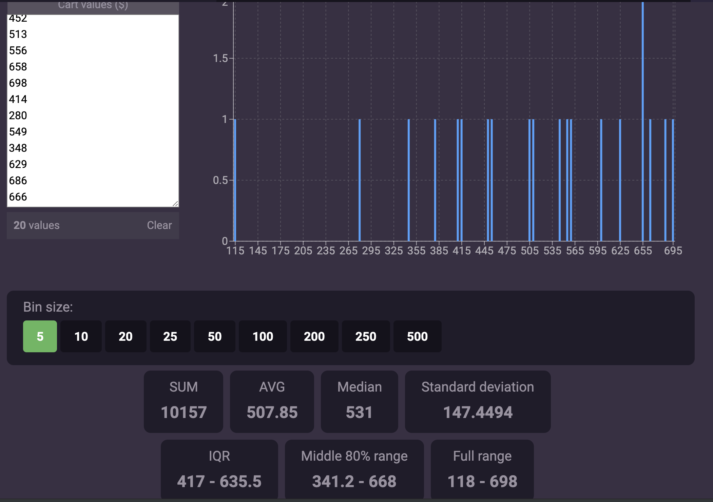
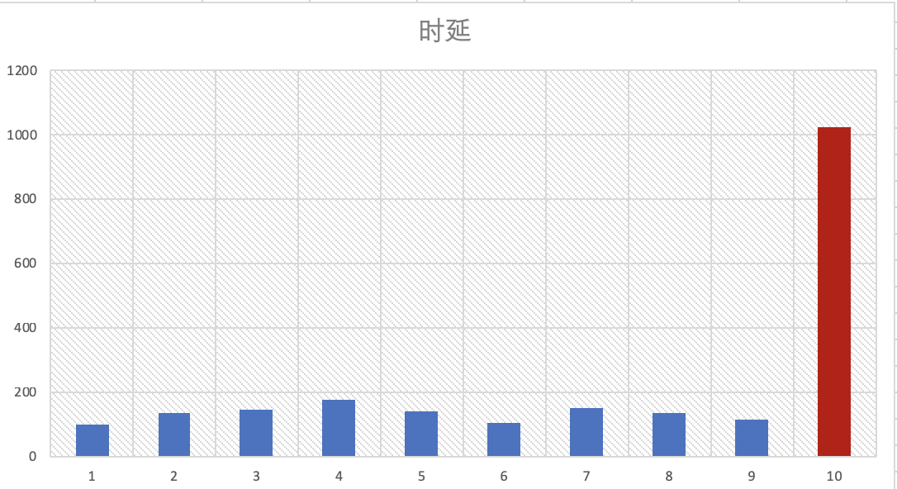
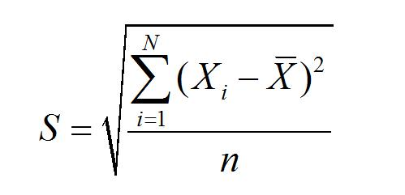
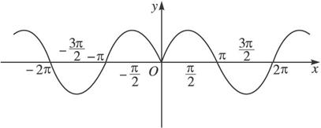

# 用Histogram统计时延

<!-- MDTOC maxdepth:6 firsth1:1 numbering:0 flatten:0 bullets:1 updateOnSave:1 -->

- [用Histogram统计时延](#用histogram统计时延)   
   - [Histogram 概念](#histogram-概念)   
      - [在线工具计算](#在线工具计算)   
      - [metrics 计算](#metrics-计算)   
   - [TP99是什么？分位数](#tp99是什么？分位数)   
   - [标准差：衡量波动幅度](#标准差：衡量波动幅度)   
   - [测试百度的响应时间](#测试百度的响应时间)   

<!-- /MDTOC -->

## Histogram 概念


给定一组数据，它是一个HTTP服务的响应时延：

``` text
459, 118, 384, 564, 655, 509, 601, 418, 452, 513, 556, 658, 698, 414, 280, 549, 348, 629, 686, 666
```


观测这组数据，怎么评价这个服务响应时延的好坏呢？

最大值？最小值？可以，但是因为最大和最小都有一定的突发性，不具备代表性。

平均值？相对有代表性。


### 在线工具计算

借助在线工具 https://www.answerminer.com/calculators/histogram/ 很快进行``Bin``归纳计算：




通过图形可以看出，这组数据的平均值是507.85，而且分布很均匀（因为我们是用Excel的``RANDBETWEEN(100, 700)``函数生成的，它是均匀分布的随机变量）。


### metrics 计算


先引用开发包：

```xml
<dependency>
		<groupId>io.dropwizard.metrics</groupId>
		<artifactId>metrics-core</artifactId>
		<version>3.1.2</version>
</dependency>

```


用``com.codahale.metrics.Histogram``来统计：

``` java

// 一个HTTP服务的响应时延数据
int[] responseLatencyMS = new int[]{
							459, 118, 384, 564, 655, 509, 601, 418, 452, 513, 556, 658, 698, 414, 280, 549, 348, 629, 686, 666
        };


// histogram 计算器
Histogram histogram = new Histogram(new ExponentiallyDecayingReservoir());


// 数据录入
int i = 0;
while (i < responseLatencyMS.length) {
		histogram.update(responseLatencyMS[i]);  // 数据录入
		i++;
}


// histogram 结果输出
Snapshot r = histogram.getSnapshot();

System.out.println("Max（最大值）: " + r.getMax());
System.out.println("min（最小值）: " + r.getMin());
System.out.println("Mean（平均值）: " + r.getMean());
System.out.println("Median（中位数）: " + r.getMedian());
System.out.println("StdDev（标准差）: " + r.getStdDev());


// 概念：TP100 就是 Max; TP50 就是 中位数。
// TP99不是指99%的情况，时延是多少；也不是指99%的平均值；而是99%的最大值（先从小到大排列）
// 或者更形象方便的说是99%的时延不超过XX。
System.out.println("TP99（第99%分位数的取值）: " + r.get99thPercentile());
System.out.println("TP95（第95%分位数的取值）: " + r.get95thPercentile());
System.out.println("TP75（第75%分位数的取值）: " + r.get75thPercentile());
```


可以看出，直接通过``histogram.update(responseLatencyMS[i]); ``给计算器喂数据，它就能帮计算最大值、最小值、平均值、中位数和标准差了。


细心的同学，还会看到上面代码里有``TP99``，``TP95``和``TP75``，这是什么？


## TP99是什么？分位数

回答TP99之前，我们先看这么个问题：

有两个数字：一个是0，一个是100，它们的平均值是50。

另外两个数字：两个都是50，平均值自然也是50。

从平稳性角度看，自然是后者更好，但是从平均值里面看不出来。当然能结合最大值和最小值来看。


再看下面这组数据，绝大多数取值稳定在(100,200)之间，但就是最大值跳变得很厉害高达1024：

数组： 101,137,144,177,140,103,151,133,117,1024




虽然Max跳点厉害，但是如果100次，只有1次，99次都稳定维持在(100,200)，我们可以把那个跳点作为个案或特例，不用解决，因为总会有一些异常情况，只要这个比例足够低，就不影响大局。


于是我们有结论：

- 我们期望服务的时延相对稳定，比如稳定在(100,200) ms。
- 我们能接受偶尔的跳点，甚至离谱到1024ms。
- 但是我们期望控制跳点的比例，让它足够小，小到不影响大局。


换句话说，我们期望看99%的情况，是否会出现离谱的跳点？于是我们把响应时延，从小到大排列，看第99%的位置，出现的时延，这就是T99。比如T99=300ms，请注意：

- TP99，不是指 99%的情况下，时延都是300ms。
- 也不是指 99%的情况下，平均时延是300ms。
- 而是从小到达排列后，前99%的 **最大时延** 是300ms。即：99%的情况下不超过300ms。这样就把后面 1% 的波动去掉后算最差的情况。


> TP99，是指从小到大排列，前99%的最大值。这么说来：
>
> ``TP100``就是Max最大值；而``TP50``就是Median中位数。


再引用一段Google的解释：

```

The tp90 is a minimum time under which 90% of requests have been served.

tp90 = top percentile 90

Imagine you have response times:

10s
1000s
100s
2s

Calculating TP is very simple:

1. Sort all times in ascending order: [2s, 10s, 100s, 1000s]

2. find latest item in portion you need to calculate.
2.1 For TP50 it will be ceil(4*0.5) = 2 requests. You need 2nd request.
2.2 For TP90 it will be ceil(4*0.9) = 4. You need 4th request.

3. We get time for the item found above. TP50=10s. TP90=1000s

```


用个图表示：


| 编号 | 时延(升序) | TP?      | 备注                |
| ---- | ---------- | -------- | ------------------- |
| 1    | 66         |          |                     |
| 2    | 118        |          |                     |
| 3    | 280        |          |                     |
| 4    | 348        |          |                     |
| 5    | 384        |          |                     |
| 6    | 414        |          |                     |
| 7    | 418        |          |                     |
| 8    | 452        |          |                     |
| 9    | 459        |          |                     |
| 10   | 509        | ``TP50`` | 20*0.5=10<br>中位数 |
| 11   | 513        |          |                     |
| 12   | 549        |          |                     |
| 13   | 556        |          |                     |
| 14   | 564        |          |                     |
| 15   | 601        | ``TP75`` | 20*0.75=15          |
| 16   | 629        |          |                     |
| 17   | 655        |          |                     |
| 18   | 658        |          |                     |
| 19   | 686        |          |                     |
| 20   | 698        |          |                     |


再直观感受下TP99，有200个数字，前100个是1到100，后100个也是1到100，那么它的TP99是多少呢？


``` java
responseLatencyMS = new int[] {
                1,2,3,4,5,6,7,8,9,10,11,12,13,14,15,16,17,18,19,20,21,22,23,24,25,26,27,28,29,30,31,32,33,34,35,36,37,38,39,40,41,42,43,44,45,46,47,48,49,50,51,52,53,54,55,56,57,58,59,60,61,62,63,64,65,66,67,68,69,70,71,72,73,74,75,76,77,78,79,80,81,82,83,84,85,86,87,88,89,90,91,92,93,94,95,96,97,98,99,100,
                1,2,3,4,5,6,7,8,9,10,11,12,13,14,15,16,17,18,19,20,21,22,23,24,25,26,27,28,29,30,31,32,33,34,35,36,37,38,39,40,41,42,43,44,45,46,47,48,49,50,51,52,53,54,55,56,57,58,59,60,61,62,63,64,65,66,67,68,69,70,71,72,73,74,75,76,77,78,79,80,81,82,83,84,85,86,87,88,89,90,91,92,93,94,95,96,97,98,99,100,
};
```


结果：

``` text
Max（最大值）: 100
min（最小值）: 1
Mean（平均值）: 50.49999999999999
Median（中位数）: 50.0
StdDev（标准差）: 28.866070047722115
TP99（第99%百分线的取值）: 99.0
TP95（第95%百分线的取值）: 95.0
TP75（第75%百分线的取值）: 75.0
```


TP99恰好就是 99，但这并不意味着99%的情况下，得分是99，实际上它只是前99%的最大值。


> 最后再考试一次：如果一个服务的响应时延 TP99=700ms，意味着99%的情况下，该服务的响应时延都是700ms吗？ 回答：不是！(1) 不是99%的情况下，响应时间恒等于 700ms；(2) 也不是 99%的情况下，平均响应时延为 700ms。 而是 99%的情况下，响应时延不超过 700ms (确切说，把所有响应时延从小到大排序，前 99%的最大时延为 700ms，只有后1%的跳点超过了 700ms)。


---


## 标准差：衡量波动幅度


``` text

stddev = sqrt(((x1-x)^2 +(x2-x)^2 +......(xn-x)^2)/n)

```



> 经济学中，说``价格``围绕着``价值``上下波动。如果把``价值``看着是均值线，那么标准差度量的就是价格围绕价值``波动的幅度``。


下图是sin函数，如果从均值角度，上下正好抵消，均值线就是X轴。这个时候波动幅度就能从``标准差``中看出来。




## 测试百度的响应时间

用``okhttp``去请求百度首页，并记录响应时延：

``` xml

<dependency>
		<groupId>com.squareup.okhttp3</groupId>
		<artifactId>okhttp</artifactId>
		<version>4.0.0-RC1</version>
</dependency>

```


在``HistogramDemo2.java``中，体现统计：


``` java

// 构建一个Histogram 计算器
Histogram latencyHistogram = new Histogram(new ExponentiallyDecayingReservoir());


int i = 0;
while (i < 100) {
		OkHttpClient httpClient = new OkHttpClient();
		Request request = new Request.Builder()
                        .url("https://www.baidu.com")
                        .build();

		long tmStart = System.currentTimeMillis();

  	try (Response response = httpClient.newCall(request).execute()) {

					System.out.println(new String(response.body().bytes()).substring(0, 20));

		} catch (IOException e) {
					e.printStackTrace();
		}
		long tmEnded = System.currentTimeMillis();

		// 存入响应时延
		latencyHistogram.update(tmEnded - tmStart);

		try {
				Thread.sleep(1500L);
		} catch (InterruptedException e) {
				e.printStackTrace();
		}

i ++;

```


统计结果：


``` text

-- Histograms ------------------------------------------------------------------
com.downgoon.helloworld.metrics.HistogramDemo2.adserver.letencyMS
             count = 14
               min = 109
               max = 7728
              mean = 1816.85
            stddev = 2099.81
            median = 957.00
              75% <= 2390.00
              95% <= 7728.00
              98% <= 7728.00
              99% <= 7728.00
            99.9% <= 7728.00

```
