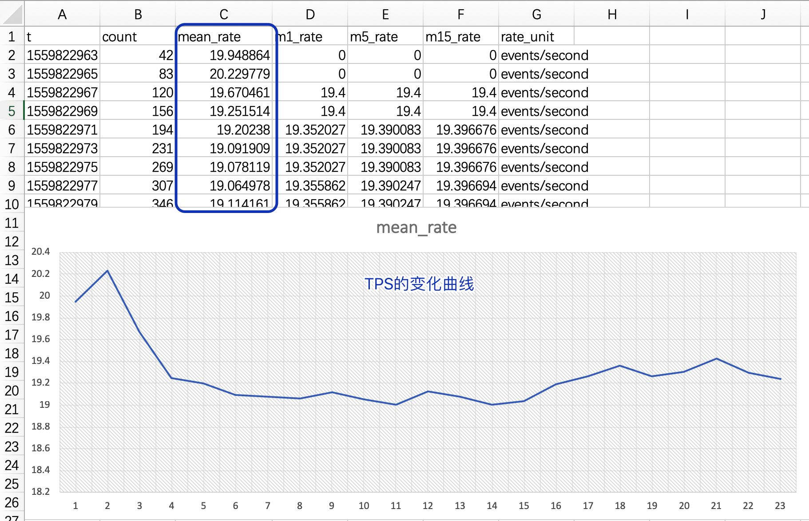

# Meter 测量仪专测 TPS

<!-- MDTOC maxdepth:6 firsth1:1 numbering:0 flatten:0 bullets:1 updateOnSave:1 -->

- [Meter 测量仪专测 TPS](#meter-测量仪专测-tps)   
   - [需求描述](#需求描述)   
   - [样例代码](#样例代码)   
   - [FAQ](#faq)   
      - [为什么是0？](#为什么是0？)   
      - [meter原理](#meter原理)   
   - [如何看TPS的变化曲线呢？](#如何看tps的变化曲线呢？)   

<!-- /MDTOC -->


## 需求描述

一个广告服务器，每秒钟能处理多少笔广告请求？即大家常说的TPS。


显然这个数据跟几个因素有关系：

1. 开始时间和结束时间：TPS说的是一段时间内，总请求数/时间，得出单位时间的请求处理数。所以压力测试的时候注意：比如晚上做压力测试，人回家，第二天早上再来看结果。这个时候看到的可能是0，因为``Meter``对象本身只会记录最近1分钟、5分钟的TPS。更早的时间不会记录。如果要第二天早上看，那得在压力测试过程中，不断把阶段性结果保存到CVS、Log日志或``influxdb``中。
2. 时间段内的压力请求：虽然处理能力很强，但是如果需求量不做，外面只有几个请求，处理能力再强，TPS也不高。所以我们平时说的TPS其实是``最大TPS``。
3. 硬件和软件环境：硬件环境包括CPU核、网络带宽；软件环境有``线程数``，代码中是否有阻塞、是否加锁等。


## 样例代码

引入依赖包：

``` xml

<dependency>
		<groupId>io.dropwizard.metrics</groupId>
		<artifactId>metrics-core</artifactId>
		<version>3.1.2</version>
</dependency>

```


``` java

MetricRegistry metricRegistry = new MetricRegistry();

String meterName = MetricRegistry.name(MeterDemo.class, "adserver", "tps");

// get or add meter instance
Meter tpsMeter = metricRegistry.meter(meterName);

new Thread(() -> {
	Random rand = new Random();

	while (true) {

		// 模拟每个请求的处理时间，按随机时间算
		try {
				Thread.sleep(rand.nextInt(100));
		} catch (InterruptedException e) {
				e.printStackTrace();
		}

		// 标记处理完了一个请求
		tpsMeter.mark();

	}

}, "request-handler").start();

```


输出结果：

``` text
-- Meters ----------------------------------------------------------------------
com.downgoon.helloworld.metrics.MeterDemo.adserver.tps
             count = 1575
         mean rate = 19.18 events/second
     1-minute rate = 18.91 events/second
     5-minute rate = 18.28 events/second
    15-minute rate = 18.10 events/second

```


## FAQ


### 为什么是0？


问题1： 晚上做压力测试，人回家，第二天早上再来看结果。这个时候看到的可能是0？为什么？

回答：因为``Meter``对象本身只会记录最近1分钟、5分钟的TPS。更早的时间不会记录。如果要第二天早上看，那得在压力测试过程中，不断把阶段性结果保存到CVS、Log日志或``influxdb``中。


### meter原理


- 创建时，记录了开始时间


``` java

/**
* Creates a new {@link Meter}.
*/
public Meter() {
		this(Clock.defaultClock());
}


public Meter(Clock clock) {
		this.clock = clock;
    // 创建时记录开始时间
		this.startTime = this.clock.getTick();

    // 记录上一次时间
		this.lastTick = new AtomicLong(startTime);
}
```


- 没有直接依赖系统时间，可以替换

``com.codahale.metrics.Clock.java``

``` java

public static class UserTimeClock extends Clock {
     @Override
     public long getTick() {
        // System.XXX 是硬编码，应用层不应该直接依赖系统时钟，而应该依赖于用户时钟
       	return System.nanoTime();
     }
}

```


- 处理一个请求时，做什么操作？


``` java

/**
* Mark the occurrence of an event.
*/
public void mark() {
        mark(1);
}

/**
* Mark the occurrence of a given number of events.
*
* @param n the number of events
*/
public void mark(long n) {
		tickIfNecessary();

    // 并发计数器
    count.add(n);
		m1Rate.update(n);
		m5Rate.update(n);
		m15Rate.update(n);
}


// 更新消耗的时间
private void tickIfNecessary() {
        final long oldTick = lastTick.get();
        final long newTick = clock.getTick();
        final long age = newTick - oldTick;
        if (age > TICK_INTERVAL) {
            final long newIntervalStartTick = newTick - age % TICK_INTERVAL;
            if (lastTick.compareAndSet(oldTick, newIntervalStartTick)) {
                final long requiredTicks = age / TICK_INTERVAL;
                for (long i = 0; i < requiredTicks; i++) {
                    m1Rate.tick();
                    m5Rate.tick();
                    m15Rate.tick();
                }
            }
        }
    }
```


- 计算TPS


``` java

@Override
public double getMeanRate() {
		if (getCount() == 0) {
            return 0.0;
		} else {
           // 总消耗时间：用系统当前时间 - 开始时间(对象创建时间)
            final double elapsed = (clock.getTick() - startTime);
            // 并发计数器总量 / 总时间 = TPS
            return getCount() / elapsed * TimeUnit.SECONDS.toNanos(1);
        }
    }
```


## 如何看TPS的变化曲线呢？


前面说了，``Meter``保存的TPS会随时间变化而变化。如果在压测时，你去喝了杯咖啡，打算回来再看压测结果，可能你要失望了，因为等你回来的时候，最近1分钟、5分钟、15分钟的结果可能都为0.


怎么办呢？不断把``snapshot``记录下来呀！

怎么记？就是 ``CsvReporter``。


``` java

// 把TPS过程保存到CSV文件夹中（不是文件）
File csvFile = new File("data");
CsvReporter csvReporter = CsvReporter.forRegistry(metricRegistry).build(csvFile);
csvReporter.start(2, TimeUnit.SECONDS);

```


输出结果是：


``` text

➜  data git:(master) ✗ tail -100f com.downgoon.helloworld.metrics.MeterDemo.adserver.tps.csv


t,count,mean_rate,m1_rate,m5_rate,m15_rate,rate_unit
1559822963,42,19.948864,0.000000,0.000000,0.000000,events/second
1559822965,83,20.229779,0.000000,0.000000,0.000000,events/second
1559822967,120,19.670461,19.400000,19.400000,19.400000,events/second
1559822969,156,19.251514,19.400000,19.400000,19.400000,events/second
1559822971,194,19.202380,19.352027,19.390083,19.396676,events/second
1559822973,231,19.091909,19.352027,19.390083,19.396676,events/second
1559822975,269,19.078119,19.352027,19.390083,19.396676,events/second
1559822977,307,19.064978,19.355862,19.390247,19.396694,events/second
1559822979,346,19.114161,19.355862,19.390247,19.396694,events/second
1559822981,383,19.050867,19.295427,19.377185,19.392281,events/second
1559822983,420,19.004045,19.295427,19.377185,19.392281,events/second

```


然后用Excel对CSV做简单的展示分析：



