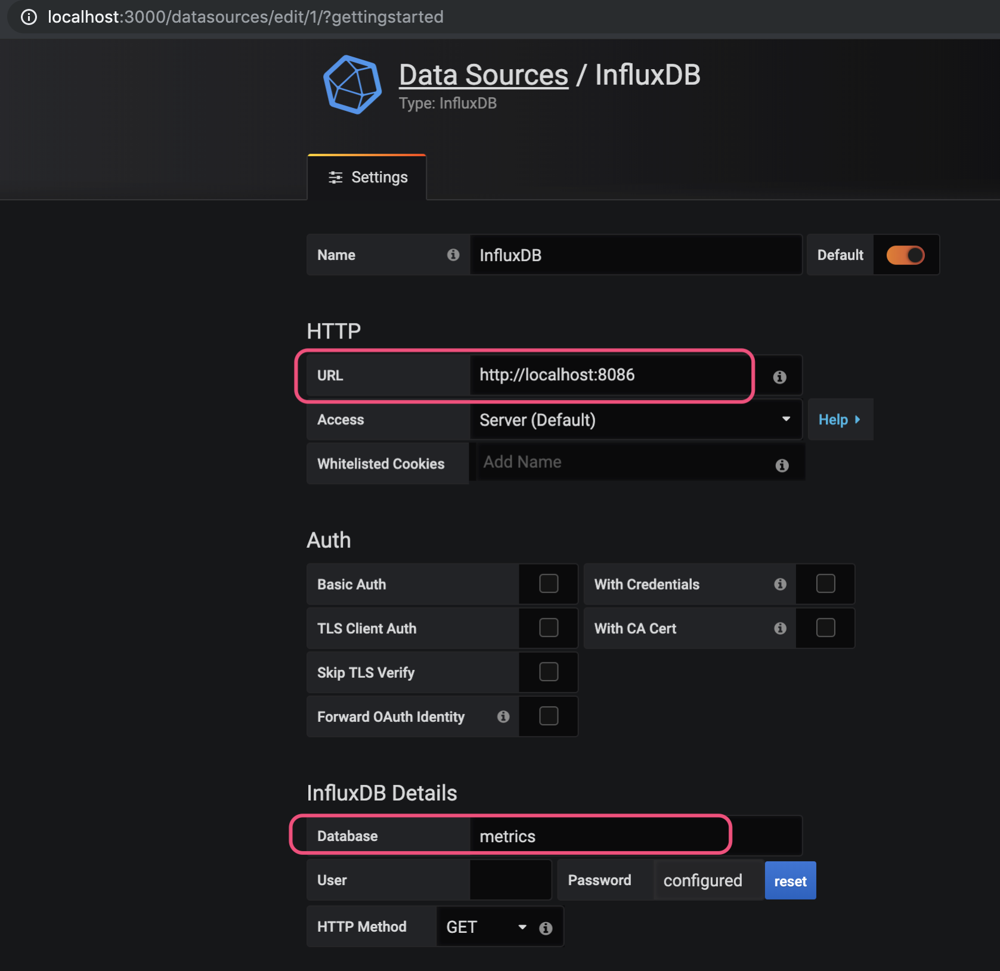
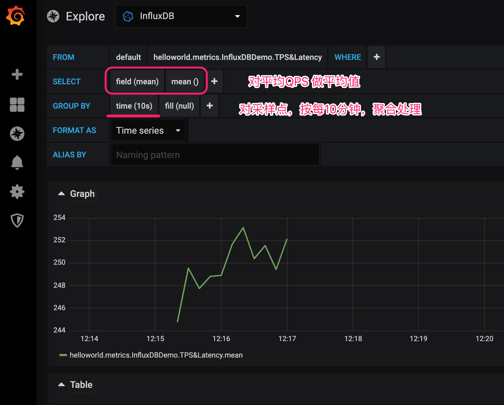

# metrics+influxdb+grafana


## 监控效果


 


## 原理简介


## 推送到InfluxDB

``metrics``的信息可以以报表的形式推送到：控制台、日志文件、CSV文件、JMX。

当然也可以推送到其他的存储系统，比如InfluxDB，而且``metrics``社区如此繁荣，这样的推送早已有开源社区写好了。引入：

``` xml

<dependency>
    <groupId>com.github.davidb</groupId>
    <artifactId>metrics-influxdb</artifactId>
    <version>1.1.0</version>
</dependency>

```


编码：

``` java

ScheduledReporter influxdbReporter = InfluxdbReporter.forRegistry(metricRegistry)
				.protocol(
						// HttpInfluxdbProtocol(String scheme, String host, int port, String user, String password, String db) 
						new HttpInfluxdbProtocol("http", "127.0.0.1", 8086, "admin", "123456", "metrics"))
				.convertRatesTo(TimeUnit.SECONDS).convertDurationsTo(TimeUnit.MILLISECONDS).filter(MetricFilter.ALL)
				.skipIdleMetrics(false) //
				.tag("cluster", "adindex4j") //
				.tag("client", "index-worker") //
				.tag("server", "Tomcat#1") //
				.transformer(new CategoriesMetricMeasurementTransformer("module", "artifact")) //
				.build();


influxdbReporter.start(10, TimeUnit.SECONDS);
```


## 附录一：influxdb安装和使用


### 功能介绍

关于 influxdb的功能介绍和数据模型，请阅读 [influxdb-introduction](influxdb-introduction.md)。


### 安装命令

Users of macOS 10.8 and higher can install InfluxDB using the [Homebrew](http://brew.sh/) package manager. Once `brew`is installed, you can install InfluxDB by running:


```bash
$ brew update
$ brew install influxdb
		安装完成地址： /usr/local/Cellar/influxdb/1.7.6
$ influxd -config /usr/local/etc/influxdb.conf
```


### 客户端访问

- 链接服务器

```bash
$ influx
Connected to http://localhost:8086 version v1.7.6
InfluxDB shell version: v1.7.6
Enter an InfluxQL query
>

$ influx -precision rfc3339
Connected to http://localhost:8086 version 1.7.x
InfluxDB shell 1.7.x
>
```


- 创建数据库

```bash
$ influx -precision rfc3339
Connected to http://localhost:8086 version 1.7.x
InfluxDB shell 1.7.x

> CREATE DATABASE mydb
> SHOW DATABASES
name: databases
name
----
_internal
mydb

> USE mydb
Using database mydb

> INSERT cpu,host=serverA,region=us_west value=0.64

> show measurements

> SELECT "host", "region", "value" FROM "cpu"
name: cpu
time                host    region  value
----                ----    ------  -----
1560225964764481000 serverA us_west 0.64


```

### 配置文件

要知道数据库存在哪里呢？

You’ll have to update the configuration file appropriately for each InfluxDB instance you have.

```ini
...

[meta]
  dir = "/mnt/db/meta"
  ...

...

[data]
  dir = "/mnt/db/data"
  ...
wal-dir = "/mnt/influx/wal"
  ...

...

[hinted-handoff]
    ...
dir = "/mnt/db/hh"
    ...
```


### 参考资料

- [influxdb 1.7 installation](https://docs.influxdata.com/influxdb/v1.7/introduction/installation/)


## 附录二：grafana安装和使用


###  安装

``` bash

$ brew update
$ brew install grafana

```


### 运行


To start Grafana using homebrew services first make sure homebrew/services is installed.

```bash
brew tap homebrew/services
```

Then start Grafana using:

```bash
brew services start grafana
```

Default login and password `admin`/ `admin`


### 登录UI


To run Grafana open your browser and go to [http://localhost:3000/](http://localhost:3000/). 3000 is the default http port that Grafana listens to if you haven’t [configured a different port](https://grafana.com/docs/installation/configuration/#http-port). Then follow the instructions [here](https://grafana.com/docs/guides/getting_started/).


登录时，用账号：admin 密码： admin

第一次登录，提示修改密码。不妨设置为：123456


### 链接到InfluxDB

- 配置数据源




- 创建趋势图




> 问题：既然metrics都是标准化的，那么对它的展现也应该是标准化的，难道就没有``grafana plugin``提前自动给``metrics``创建Dashbord吗？ 答案应该是有的。


### 配置


The Configuration file should be located at `/usr/local/etc/grafana/grafana.ini`.


### 日志


The log file should be located at `/usr/local/var/log/grafana/grafana.log`.