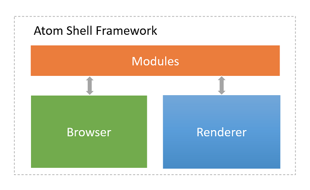

# electron

## Quick Start

``` bash
# Clone this repository
git clone https://github.com/electron/electron-quick-start
# Go into the repository
cd electron-quick-start
# Install dependencies
npm install
# Run the app
npm start

```

## 多进程结构


- Main Process 主进程

In Electron, the process that runs ``package.json``’s main script is called the main process. The script that runs in the main process can display a GUI by creating web pages.

- Renderer Process  渲染进程

Since Electron uses ``Chromium `` for displaying web pages, **Chromium’s multi-process architecture** is also used. **Each web page in Electron runs in its own process**, which is called the renderer process.

- 两者的关系

The main process manages all web pages and their corresponding renderer processes. Each renderer process is isolated and only cares about the web page running in it.

In Electron, we have several ways to communicate between the main process and renderer processes. Like ``ipcRenderer`` and ``ipcMain`` modules for sending messages, and the remote module for RPC style communication.

### 跨页面共享数据

- H5 API

>To share data between web pages (the renderer processes) the simplest way is to **use HTML5 APIs** which are already available in browsers. Good candidates are **Storage API**, ``localStorage``, ``sessionStorage``, and ``IndexedDB``.

- IPC 机制

``IPC 机制`` 是 ``Electron`` 特有的。

the IPC system, which is specific to Electron, to store objects in the main process as a global variable, and then to access them from the renderers through the ``remote`` property of electron module:

``` javascript
// In the main process.
global.sharedObject = {
  someProperty: 'default value'
}

```

页面1

``` javascript
// In page 1.
require('electron').remote.getGlobal('sharedObject').someProperty = 'new value'
```

页面2

``` javascript
// In page 2.
console.log(require('electron').remote.getGlobal('sharedObject').someProperty)
```

## HelloWorld

程序结构：

``` bash
your-app/
├── package.json  // 配置信息/组装信息（打包信息）   
├── main.js     // 控制逻辑，如果不存在 main.js ， 则会加载  index.js
└── index.html  // 表现逻辑
```

### 运行它

有了 ``HelloWorld`` 程序后，要运行它，很简单，只要在项目目录下运行命令：

``` bash
$ electron .
```

> ``electron`` 是什么呢？ 它其实只是一个 ``npm`` 模块。为了能独立运行，我们可以以全局形式安装这个模块。``npm install electron -g``

如果我们不是全局安装，而是基于项目目录安装，则执行：

``` bash
$ ./node_modules/.bin/electron .
```

### 发布

----

# 项目驱动

https://github.com/bojzi/sound-machine-electron-guide


---

# REFER

- [electron quick-start](https://electron.atom.io/docs/tutorial/quick-start/)
- [how-to-share-data-between-web-pages](https://electron.atom.io/docs/faq/#how-to-share-data-between-web-pages)
- [application-distribution](https://electron.atom.io/docs/tutorial/application-distribution/)

- [国内项目驱动](http://get.ftqq.com/7870.get)

- [基于electron的优秀项目](http://www.open-open.com/lib/view/open1431415409247.html)
- [Atom Shell Architecture](https://github.com/ilyavorobiev/atom-docs/blob/master/atom-shell/Architecture.md)

- [awesome-electron](https://github.com/sindresorhus/awesome-electron)

----

# 附录-1：``npm`` 环境

## 重装 ``npm``

手动卸载了再重装了npm

1. ``sudo npm uninstall npm -g``
如果步骤1卸不掉npm了（我就是这种情况）

2. 进到npm的安装目录

``` bash
cd /usr/local/lib/node_modules/npm/
sudo make uninstall
```

3. 手动重装npm

``` bash
curl -L https://npmjs.com/install.sh | sh
```

## 淘宝镜像

>安装 ``electron`` 模块会比较费劲，必须得用国内镜像。

淘宝npm镜像： https://npm.taobao.org/

- 指定镜像站点

``` bash
$ npm install -g <your-package-name> --registry=https://registry.npm.taobao.org
```

- 用淘宝的命令行 ``cnpm``

相对于 ``npm`` ，淘宝有个命令行叫 ``cnpm``， 估计是 ``China npm``的意思。
要用``cnpm``，自然先要安装 ``cnpm``，它自己也是个模块，在淘宝镜像上就有。

``` bash
// 全局安装 cnpm， 安装时指定淘宝镜像
$ npm install -g cnpm --registry=https://registry.npm.taobao.org

// 以后就使用 cnpm 了，跟 npm 操作一样
$ cnpm install -g electron
```
## 再看 electron

``electron`` 非常类似 微信小程序的思想，微信下载已不仅仅是一个``App``了，而是一个``Runtime``，它能够加载其他的应用，并形成一个生态。

- 微软的``vscode``都是基于 ``electron`` 开发的。
>Electron提供了丰富的本地（操作系统）的API，使你能够使用纯JavaScript来创建桌面应用程序。
>与其它各种的Node.js **运行时** 不同的是Electron专注于桌面应用程序而不是Web服务器。

## 访问OS资源

Traditional web pages are designed to be executed inside a web browser with high control and **limited access to OS resources such as file system due to security reasons**. That's why it is impossible to build web application that is interacting with native systems and resources.

>Atom Shell (electron) framework provides opportunity to create desktop application **with access to system resources using popular web technologies** HTML, CSS and JavaScript.


Framework is based on JavaScript runtime [io.js](https://iojs.org/en/) (Node.js fork with better support of new features) and web browser Chromium (open-source parts of Google Chrome).


Atom Shell framework consists of three main parts:

- **Browser-side** is responsible for business logic and data access
- **Renderer-side** is responsible for UI rendering
- **Modules** that bridge browser-side and renderer-side, and also help control application lifecycle



# 附录-2：ES6 — 新增关键字let、const

http://es6.ruanyifeng.com/

- [30分钟掌握ES6/ES2015核心内容](http://www.jianshu.com/p/ebfeb687eb70)


http://www.cnblogs.com/telnetzhang/p/5639949.html

>``ES6``是``JavaScript``语言的下一个版本，预计将在2014年底正式发布。它对JavaScript做了大量改造，提高了灵活性和应用性，**使得这门语言真正成为了企业级开发工具**。

``ECMAScript`` 是什么？
首先，我们都知道JavaScript由三部分组成：ECMAScript，DOM，BOM；
其中的ECMAScript是Javascript的语法规范。
ECMAScript定义了很多东西，如：
- 语法-----解析规则，关键字，语句，声明，操作等
- 类型-----布尔型，数字，字符串，对象等
原型和继承
内置对象，函数的标准库----------JSON, Math, 数组方法，对象方法等

浏览器兼容：

目前Google和Firefox浏览器对ES6新特性的兼容最友好。而IE9则有问题。对于不兼容的浏览器，我们可以只用转换工具如，babel。我们使用nodejs的包管理工具npm来安装babel。在我们的js文件前先引入 browser.min.js 。
