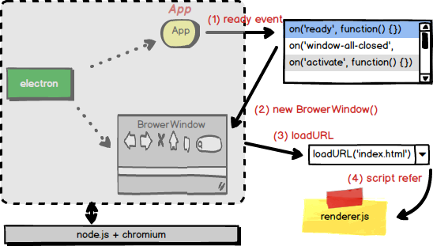
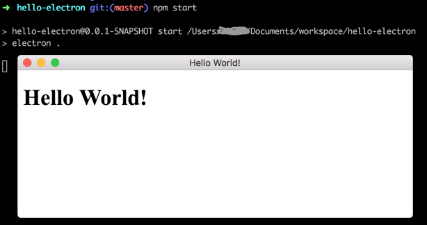
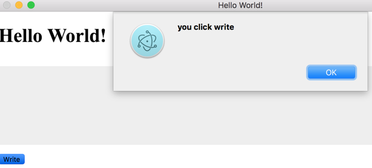
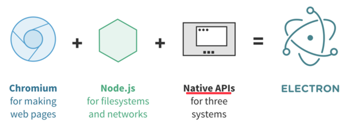

# hello-electron

<!-- toc -->

<!-- TOC depthFrom:1 depthTo:6 withLinks:1 updateOnSave:1 orderedList:0 -->

- [hello-electron](#hello-electron)
	- [QuickStart](#quickstart)
		- [start](#start)
		- [package](#package)
	- [index.html](#indexhtml)
	- [server.js](#serverjs)
	- [main.js](#mainjs)
	- [网页交互](#网页交互)
	- [调用node](#调用node)
	- [electron 本质](#electron-本质)
	- [打包发布](#打包发布)
		- [安装打包工具](#安装打包工具)
		- [执行打包任务](#执行打包任务)
		- [多平台打包](#多平台打包)
	- [installer 包制作](#installer-包制作)
	- [jquery-electron](#jquery-electron)
- [附录-1： git 提交历史](#附录-1-git-提交历史)
- [参考资料](#参考资料)

<!-- /TOC -->


## QuickStart

### start

```
$ git clone https://github.com/downgoon/hello-electron.git
$ cd hello-electron
$ npm start
```

### package

直接运行：

``` bash
$ electron-packager . --overwrite --out=target  --icon=img/hello
```

如果每次写那么多参数，嫌麻烦，也可以：

``` bash
$ npm run-script package
```

原因是命令参数提前配置到``package.json``里面了：

>
``` json
"scripts": {
	"start": "electron .",
	"package": "electron-packager . --overwrite --out=target  --icon=img/hello"
},
```

其中``package``字段是自定义命令（``start``命令是``npm``的自有命令）。

在``Mac``下生成的可执行文件：``target/helloworld-electron-darwin-x64/helloworld-electron.app``

## index.html

刚开始，只有一个 ``index.html``页面，显示``Hello World``：

``` html
<!DOCTYPE html>
<html>
<head>
  <meta charset="UTF-8">
  <title>Hello World!</title>
</head>
<body>
  <h1>Hello World!</h1>
</body>

</html>
```

这个页面可在本地直接用浏览器打开，提交``c1-index.html``。

## server.js

除了本地直接用浏览器打开``index.html``，我们还可以用``node.js``写一个web server，以便在浏览器中输入：http://127.0.0.1:8080/index.html

``` javascript

var http = require('http');
var fs = require('fs');

http.createServer( function (request, response) {

  console.log('request comming: ' + request.url);

  fs.readFile('index.html', function (err, data) {
    response.writeHead(200, {'Content-Type': 'text/html'});
    response.write(data.toString());
    response.end();
  });

}).listen(8080);

console.log('server running at http://127.0.0.1:8080/');
```

这段代码逻辑比较简单，加载了两个模块：``http``和``fs``，前者是Web服务器，后者是文件系统。用``http``在8080端口启动一个Web服务，对任何请求，都读取``index.html``并写入客户端做HTTP响应（文件读取是异步的）。


运行 ``server.js``：

``` bash
$ node server.js
server running at http://127.0.0.1:8080/
request comming: /index.html
```

上述代码提交日志是：``c2-server.js``。

## main.js

基于node的B/S结构，并不是我们的目标。我们期望用``electron``来加载``index.html``，而无需网络通信，我们要构建桌面程序。

``` javascript
var electron = require('electron');

electron.app.on('ready', function createWindow () {

  new electron.BrowserWindow(
      {width: 800, height: 600}
    ).loadURL('file://' + __dirname + "/index.html")

} );
```

上述``main.js``代码，不再需要用户在浏览器上输入URL，而是主动加载URL：

>``.loadURL('file://' + __dirname + "/index.html")``

这个``loadURL``的能力，是``electron``模块的，因此开头``var electron = require('electron');``。

``electron``有两个重要对象：
- ``app``: 管理应用程序的声明周期。代码``app.on('ready', function () {})``表示当应用初始化完毕后，创建一个窗口。
- ``BrowserWindow``: 浏览器窗口对象。可以用 ``new electron.BrowserWindow()`` 的方式创建一个窗口，并``loadURL``一个html页面。

组成结构和加载过程如下图所示：



直接运行``node main.js``会报错，找不到``electron``模块，原因是它不是node的内置模块，我们借助``npm``包管理器来运行。

``` bash
$ node main.js

Error: Cannot find module 'electron'
    at Function.Module._resolveFilename (module.js:325:15)
    at Function.Module._load (module.js:276:25)
```

>``npm``之于``node.js``，犹如``maven``之于``java``。``maven``用``pom.xml``描述依赖关系；而``npm``用``package.json``描述依赖关系。

``package.json``内容：

``` json
{
  "name": "hello-electron",
  "version": "0.0.1-SNAPSHOT",
  "description": "HelloWorld electron",
  "main": "main.js",
  "scripts": {
    "start": "electron ."
  },
  "devDependencies": {
    "electron": "~1.6.2"
  }
}
```

上面主要描述了3个信息：

- **meta**: 关于项目本身的描述，比如``name``，``version``等。
- **入口**：程序的入口是``main.js``，需要用``electron .``来启动。这里的``electron``是``npm``的全局模块，可提前安装``npm install -g electron`` （一定要以``-g``选项安装）。
- **依赖**：描述项目依赖``electron-1.6.2``版本。

完后，在项目根目录下直接运行：

``` bash
$ npm start
```

或者 ``electron .`` 也可以。



代码提交日志：``c3-main.js``


## 网页交互

接着丰富下``index.html``，在页面上弄个输入框和按钮。用``CSS``样式渲染下输入框；并用``javascript``响应按钮点击事件。

- 按钮响应动作

``` html
<body>
  <h1>Hello World!</h1>
  <textarea rows="10"></textarea>
  <button onclick="alert('you click write');">Write</button>
</body>
```

- 输入框渲染

``` html
<head>
  <style type="text/css">
  body {
    margin: 0;
  }

  textarea {
    width: 100%;
    border: none;
    background: #eee;
    margin: 10px 0;
    padding: 0;
    outline: none;
  }
  </style>
</head>
```

- 运行效果



git提交日志：``c4-interaction``


## 调用node

刚才演示的跟传统网页没任何区别，依然是纯前端技术（指基于浏览器的）。但是``electron``是桌面程序，它的特别之处在于：在``.html``网页中，可以直接引用``node.js``，相当于直接从前端跨入了后端，而且无需网络通信。

- renderer.js

``` javascript

var fs = require('fs');

var myTextarea = document.getElementsByTagName('textarea')[0];
var myButton = document.getElementsByTagName('button')[0];

// get input from textarea and write it into message.txt

function writeFile() {
  var text = myTextarea.value;
  fs.writeFileSync('message.txt',
  text, 'utf8');
}

myButton.onclick = writeFile;

```

这段javascript是node，但是它却可以访问网页的DOM对象，这就是``electron``的神奇之处。

- 引用js

在``index.html``中，引用JS：

``` html
<body>
  <h1>Hello World!</h1>
  <textarea rows="10"></textarea>
  <button>Write</button>
</body>

<script>
   require('./renderer.js')
</script>
```

git提交日志：``c5-callnode``


## electron 本质

看到这 ``electron`` 似乎没有太多原创的东西，依赖的是``node.js``和``chromium``。官方的概括图是：



看完这个图，让人觉得非常类似微信的``小程序``：提供了一个``Runtime``，给第三方开发者，第三方开发者可以用类似JavaScript的语言来操作手机硬件资源和微信用户信息，因为微信这个母体把手机操作系统层的差异都屏蔽，并抽象出API了。


## 打包发布

### 安装打包工具

``` bash
npm install electron --save-prod
npm install electron-packager -g
```

执行完，会在``package.json``下自动添加：

``` json
"dependencies": {
    "electron": "^1.6.11",
}
```

**npm安装指令详解**

>详细了解``npm install``，请前往：[npm install](npm-install.md)

### 执行打包任务

``` bash
electron-packager <sourcedir> <appname> --platform=<platform> --arch=<arch> [optional flags...]
```

最简单的，直接执行：

``` bash
$ electron-packager .
```

生成的安装包结构：

``` bash
$ tree helloworld-electron-darwin-x64 -L 1
helloworld-electron-darwin-x64
├── LICENSE
├── LICENSES.chromium.html
├── helloworld-electron.app   // Mac 程序
└── version
```

**参数解释**

- ``sourcedir``： 源文件目录，属必选参数。表示需要把哪些东西打包。通常可以是项目的根目录，或者如果把源文件都放``app``子目录的话，那就是``app``子目录。

- ``appname``: 应用程序名称，也就是打包后，可执行文件的文件名。它实际是一个可选参数，如果为空，则会取``package.json``里的``productName``或``name``字段（前者优先，以便开发时内部叫``name``，但是发布时外部叫``productName``）。

- ``发布平台``：``electron``是跨平台的，可以打包到``Mac``，``Windows``和``Linux``三个主流平台。可通过参数``--platform=<platform>``和``--arch=<arch>``来指定。通常有三种组合：
	- **当前平台**：如果不指定``--platform``和``--arch``，打包时，会默认生成当前平台的包（比如打包命令在``Mac``下运行，那就生成``Mac``平台的）。
	- **所有平台**: 如果参数为``--all``，打包时，会生成3套平台。
	- **特定平台**：如果``--platform=darwin --arch=x64``，则表示``Mac``平台64位机；如果``--platform=win32 --arch=x64``，则表示``Win``。
- **常见Flags**：除了上面3个参数外，还有一些可选标志
	- ``--overwrite``： 表示覆盖。如果没这个参数，打包过一遍的，再打包会提示已经打包了；如果有这个参数，就会直接覆盖过去的打包。
	- ``--icon=./img/hello``： 应用程序图标。注意：**图标的后缀名不用写**，因为它是跨平台的，在windows下，会取``hello.ico``；在Mac下会取``hello.icns``；如果写死了``.icns``，则在Windows平台，由于文件格式不对，会被忽略。
	- ``--out ./target``： 指定打包的生成目录，默认是当前目录。


**平台有哪些？**

>- ``--platform``: linux, win32, darwin, mas, all
> - ``--arch``: ia32, x64, armv7l, all

### 多平台打包

除了上文的依据当前平台，自动决策打包外，还可以显示指定打包特定平台，比如我们可以在``package.json``中配置：

``` json
"scripts": {
	"start": "electron .",
	"package": "electron-packager . --overwrite --out=target  --icon=img/hello",
	"package-mac": "electron-packager . --overwrite --platform=darwin --arch=x64 --out=target  --icon=img/hello.icns",
	"package-win": "electron-packager . --overwrite --platform=win32 --arch=ia32 --out=target  --icon=img/hello.ico",
	"package-linux": "electron-packager . --overwrite --platform=linux --arch=x64 --out=target  --icon=img/hello.png"
},
```

然后运行：

``` bash
$ npm run package-linux   // 打包Linux
$ npm run package-win   // 打包Windows
$ npm run package-mac		// 打包Mac
```

顺便提一下，指定特定平台时，icon图片，可以跟平台相关，后缀分别是：``.ico``，``.png``和``.icns``。

## installer 包制作

刚才的打包，还仅仅是打包成了可执行文件，但是并不能一键安装，而是带着目录的绿色软件。

- mac installer

```
$ npm run installer-mac
```

前提是先执行上面的``package``操作：``npm run package-mac``

**详细安装包制作**

> 请参考: [installer-made.md](installer-made.md)

## jquery-electron

通常在前端使用jquery的时候，这么引用：

``` javascript
<script src="js/jquery.js">
</script>
```

但是，这样不能在``electron``里面工作，详情请见 [issues-1](https://github.com/downgoon/hello-electron/issues/1)。

网友有人提出了一个引用方式，它能同时让 ``jquery`` 在浏览器里面和``electron``里面工作，方式如下：

``` javascript

<!-- Insert this line above script imports  -->
<script>if (typeof module === 'object') {window.module = module; module = undefined;}</script>

<!-- normal script imports etc  -->
<script src="js/jquery.js">
</script>

<!-- Insert this line after script imports -->
<script>if (window.module) module = window.module;</script>

```

详细见 [jquery-electron-demo.html](jquery-electron-demo.html) 页面。

---

# 附录-1： git 提交历史

``` bash
commit ebe00af32992041    c1-index.html
commit b730d4a1c605f6     c2-server.js
commit 230a72cac9104364   c3-main.js
commit be3f65bce233fd     c4-interaction
commit b6f9befb7ac67c5    c5-callnode
commit 25093f4ba4ccd13    c6-electron-summary
```

如果想看 ``c3-main.js`` 提交点的代码，请执行：

``` bash
$ git checkout 230a72cac9104364
```

---

# 参考资料

- [官方 electron-quick-start](https://github.com/electron/electron-quick-start)

- [用node写简易的静态Web服务器](http://www.runoob.com/nodejs/nodejs-web-module.html)

- [用electron写的扬声器应用](http://get.ftqq.com/7870.get)

- [electron本质](https://segmentfault.com/a/1190000007503495)

- [electron-packager-tutorial](https://www.christianengvall.se/electron-packager-tutorial/)

- [electron-develop-practice](https://sneezry.com/2016/01/05/electron-develop-practice-part2/)

- [electron-packager API](https://github.com/electron-userland/electron-packager/blob/master/docs/api.md)

- [electron-packager-tutorial](https://www.christianengvall.se/electron-packager-tutorial/)

- [mac installer DMG](https://www.christianengvall.se/dmg-installer-electron-app/)
