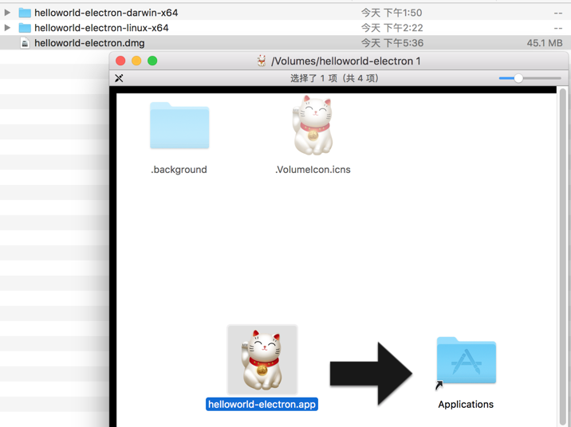

# 制作安装包

执行：

``` bash
$ electron-packager . --overwrite --out=target  --icon=img/hello
```

仅仅是``打包``，打包出来的是绿色软件。并非安装包（``installer``），比如Mac下的``.dmg``可执行文件。如果需要制作成安装包，还需要在``package``的基础上，再加工处理。

## Mac installer

### 安装工具

以全局的方式安装``electron-installer-dmg``模块：

``` bash
$ npm install electron-installer-dmg -g
```

### 快速制作

```
$ cd hello-electron
$ electron-installer-dmg ./target/helloworld-electron-darwin-x64/helloworld-electron.app helloworld-electron
```

命令非常简单，第一个参数是指定之前``package``阶段生成的``helloworld-electron.app``路径，第二个参数是应用程序名称，然后等一会儿就会在当前目录下生成``hello-electron.dmg``，需要有点耐心，生成较慢（当然你也可以用``--debug``来显示生成过程日志）。

### 详细制作

- 显示制作过程

用``--debug``显示制作过程日志，用``--overwrite``覆盖已经生成的installer：

```
$ electron-installer-dmg ./target/helloworld-electron-darwin-x64/helloworld-electron.app helloworld-electron --overwrite --debug
```

- 使用语法

``` bash
electron-installer-dmg
Usage: electron-installer-dmg <path/to/.app> <appname>

Create DMG installers for your electron apps.

Usage:
  electron-installer-dmg ./FooBar-darwin-x64/FooBar.app FooBar

Options:
  --out=<path>         The directory to put the DMG into. [Default: `process.cwd()`].
```

- 详细参数

``` bash
electron-installer-dmg ./target/helloworld-electron-darwin-x64/helloworld-electron.app helloworld-electron --out=./target --icon=img/hello.icns --overwrite --debug
```

- 不想记参数

上面参数太多了，每次输入很麻烦，可以写入``package.json``的``scripts``节点：

``` json
"scripts": {
  "start": "electron .",
  "installer-mac": "electron-installer-dmg ./target/helloworld-electron-darwin-x64/helloworld-electron.app helloworld-electron --out=./target --icon=img/hello.icns --overwrite --debug"
},
"devDependencies": {
  "electron": "~1.6.2",
  "electron-packager": "^8.7.1"
}
```

其中的 ``scripts.installer-mac`` 节点，里面用到的命令是``electron-installer-dmg``，由于我们之前是全局安装``electron-installer-dmg``的，所以无需在``devDependencies``描述对``electron-installer-dmg``的依赖关系。


### 成果测试

双击``helloworld-electron.dmg``即可自动安装：




## 参考资料

- [electron mac installer 教程](https://www.christianengvall.se/dmg-installer-electron-app/)
