# springboot-docker-hello-world

本文主要讲解如何在Docker下部署SpringBoot代码，特意借用了Spring官方教程 [Spring Guides: Building a RESTful Web Service](https://spring.io/guides/gs/rest-service/) 的代码。


## 本地直接运行

- 编译

``` bash
$ mvn clean package
```

- 运行

``` bash
$ java -jar target/springboot-docker-hello-world-0.1.0.jar
```

- 访问

``` bash
$ curl http://localhost:8080/greeting
{"times":1,"content":"Hello, World!"}%
```


## 本地Docker运行

要在Docker环境运行SpringBoot，需要以下几个步骤


### 制作镜像

``` bash
$ docker build . -t springboot-docker-hello-world
```

它等效于

``` bash
$ docker build . -f Dockerfile -t springboot-docker-hello-world
```

**温馨提示**： 制作完成的镜像，可以通过``docker images``命令查看。

``` bash
$ docker images
REPOSITORY                                     TAG                 IMAGE ID            CREATED             SIZE
springboot-docker-hello-world                  latest              e12bdfd38cf3        5 minutes ago       660MB
```


**附录**： Dockerfile 内容如下：

``` yml

# Run on Docker.com
# FROM java:8

# Run on daocloud
FROM daocloud.io/library/java:openjdk-8u40-b22
MAINTAINER downgoon@qq.com
COPY target/springboot-docker-hello-world-0.1.0.jar hello-world.jar
CMD ["java", "-jar", "hello-world.jar"]

```


### 运行镜像


运行镜像很简单，直接``docker run springboot-docker-hello-world``即可。

>但是，注意到我们这个SpringBoot是一个Web服务，需要访问 8080 端口，因此运行docker时，得额外做个``端口映射关联``————比如把宿主机的``18080``端口映射到容器内的``8080``端口。最终命令：

``` bash
$ docker run -p 18080:8080 springboot-docker-hello-world
```

访问RESTful服务，则该用 18080 端口：

``` bash
$ curl http://localhost:18080/greeting
{"times":1,"content":"Hello, World!"}
```


## 在云上跑


要在云上跑，我们得找个云计算厂商。国内免费的有 [daocloud.io](https://www.daocloud.io/)，它提供一个名叫“胶囊容器”的概念，可以**免费试用12小时**，12小时结束后，容器自动释放，需要的时候可再次申请。预先说明下，本小节将涉及以下三个配置文件：

```bash
➜  springboot-docker-hello-world git:(master) ✗ tree . -L 1
.
├── Dockerfile  # 说明#2. docker build 时使用的配置文件
├── README.md
├── assets
├── daocloud.yml # 说明#3. DaoCloud 执行 Pipeline 时的配置文件
├── pom.xml  # 说明#1. maven编译工具的配置文件
├── src
└── target
```


- **Maven配置**：在``mvn clean package``时使用的 ``pom.xml``配置。
- **Docker配置**： ``Dockerfile``文件，在``docker build`` 时使用的配置文件。
- **Pipeline配置**： 在 [daocloud.io](https://www.daocloud.io/) 的DevOps里，描述工作流的配置文件。


### 创建镜像项目

在 [daocloud.io](https://www.daocloud.io/)，为了生成镜像，需要创建一个项目，不妨叫``springboot-docker-hello-world``，并设置它的**代码源** [springboot-docker-hello-world@coding.net](https://coding.net/u/downgoon/p/springboot-docker-hello-world/git)。稍后，DaoCloud就会自动下载源代码，并读取其根目录下的``Dockerfile``文件，按这个文件构建镜像。


- **创建项目**：

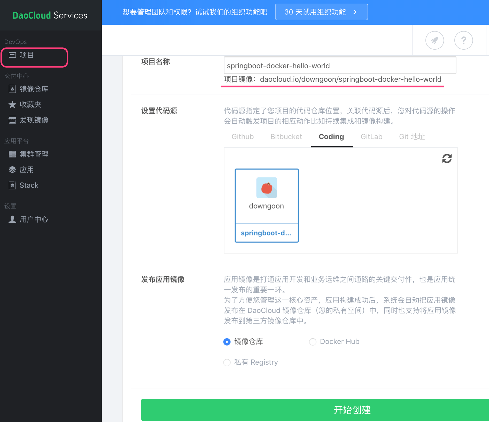


**顺便提示**： 为了让本地已发布到Github.com的代码，再额外发布一份到国内的coding.net，可执行如下指令：

``` bash

$ git remote add coding git@git.coding.net:downgoon/springboot-docker-hello-world.git
$ git push coding master

```


### 设置pipeline


**什么是pipeline ? ** ``Pipeline`` 是专门用来描述DevOps流程的YAML脚本。在``Pipeline``术语里，一个``Pipeline``是若干个``Stage``的序列，多个Stage之间是串行执行的；每个Stage是若干个``Job``，多个Job之间是并行执行的。


如下图设置的pipeline：

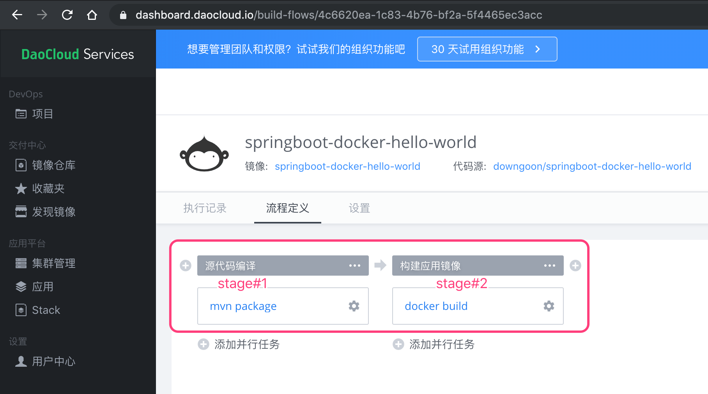


这个``可视化``设置背后的``.yml``是（已保存为``daocloud.yml``）：

``` yml
version: 3
stages:
- 源代码编译
- 构建应用镜像
docker build:
  stage: 构建应用镜像
  job_type: image_build
  only:
    branches:
    - .*
    tags:
    - .*
  allow_failure: false
  dependencies: # 作业间的依赖关系
  - mvn package
  build_dir: /
  cache: true
  dockerfile_path: daocloud.io/Dockerfile
mvn package:
  stage: 源代码编译
  job_type: maven
  only:
    branches:
    - .*
    tags:
    - .*
  pull_request: false
  allow_failure: false
  context:
    path: []
  envs: []
  image: maven:latest
  name: mvn package
  scripts:
  - mvn clean package
  services: []

```

我们把它保存到项目根目录的``daocloud.yml``文件里，以后就可以直接复用了。


### No Such File


按上述配置，运行时出现如下问题：

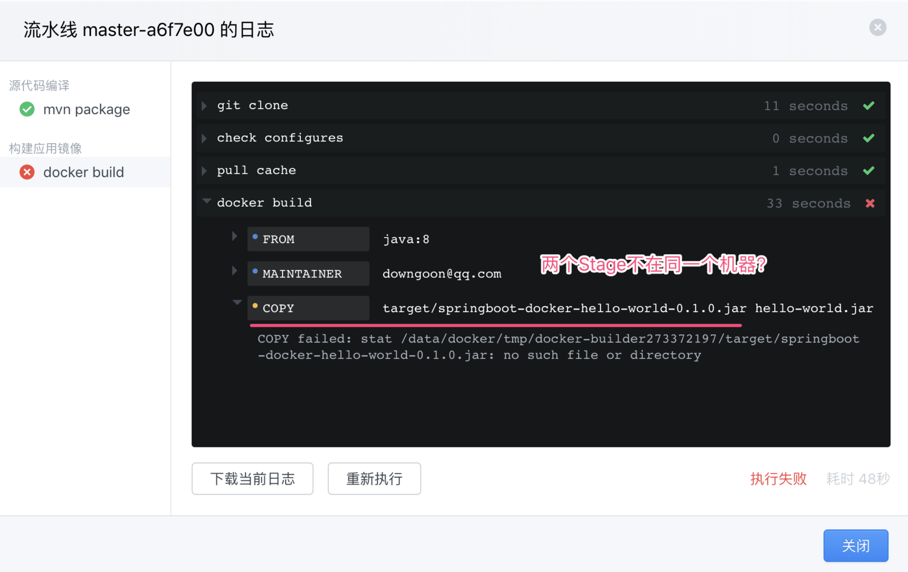


> **具体情况**：第一步``mvn package``运行成功；但是第二步的``docker build``运行失败。原因是第一步生成的``target/springboot-docker-hello-world-0.1.0.jar``，在第二步里面找不到！


解决这个问题，涉及到``pipeline``调度机制。当我们给DaoCloud提交一个pipeline时，DaoCloud的**工作流引擎**是如何把它分派给工作流集群的各个节点的。按我们推断，它至少涉及这些概念：

1. **Stage间逻辑先后**： 按pipeline的语义，一个pipeline是Stage的序列，Stage之间是串行执行的，它们之间有严格的先后顺序。
2. **Stage间物理粘黏**： 除了逻辑上的先后，还需考虑物理上是否``粘黏``（英文``Sticky``）。什么意思呢？就是如果第一步在A节点/机器上执行，那么第二步就必须粘黏住，也得在A节点/机器上执行。否则第二步就无法使用第一步输出的中间结果（中间结果输出在节点/机器的文件系统上）。这非常类似Nginx给后端Tomcat做HTTP请求的分发，如果涉及到Session的链接，也可能需要``粘黏``。但是现代软件设计，都提倡应用层无状态，状态都应该存储在数据层。相应的，在工作流集群中，如果所有节点都共享类似 [ceph](https://ceph.io/) 云存储，就不用在工作流应用层利用调度时的``粘黏性``来解决这个问题。
3. **Job间并行**： 按pipeline的语义，Stage内的多个Job是并行执行的。这样工作流引擎完全可以把这些Job分发给多个节点，从而并行运行。当然依然要遵循下一个Stage内的Job需要等上一个Stage的所有Job都运行完成才能开始。


**顺便说一下**， 关于``流程``刻画，最完备的当属 [BPMN 2.0](https://en.wikipedia.org/wiki/Business_Process_Model_and_Notation) 国际标准，它所能刻画的流程语义更为丰富和复杂。但在DevOps领域，大家普遍使用的还是简单明了的``Pipeline``模型——串行的Stage和并行的Job。


## 换个方式在云上跑


上述``粘黏性``的问题没有解决，但是注意到daocloud官方教程 [在新流水线使用 Java 应用演示](http://guide.daocloud.io/dcs/java-12004750.html) 采用了一种被称作为``「安全构建」``的特有方式解决的。它涉及到以下几个配置文件，均在项目根目录下：


- **Pipeline**:  ``Devops-pipeline-daocloud.yml``
  - **编译**：``Dockerfile-maven-package.yml``
    - **加速**:  在``pom.xml``中添加``repositories``节点
  - **镜像**:  ``Dockerfile-java-runjar.yml``
- **运行应用**： ``Dockerfile-k8s-daocloud.yml`` 把镜像推送到K8S集群，以便分配集群资源并运行。


在 [daocloud.io](https://daocloud.io) 中，``安全构建``是个特有的术语，它是**一个任务Job**，但却可以有**两个步骤**(这里的步骤不是``Pipeline``的两个``Stage``，似乎DaoCloud的Stage之间只存在逻辑上的先后顺序，无法做到物理上的``粘黏性`——即如果第一个Stage在A宿主机上，第二个Stage也必须在A宿主机上运行，如果无法做到这一点，那么运行阶段需要提取编译阶段的JAR包就无法在两个Stage之间实现。


- **第一步**： 用maven编译出JAR包

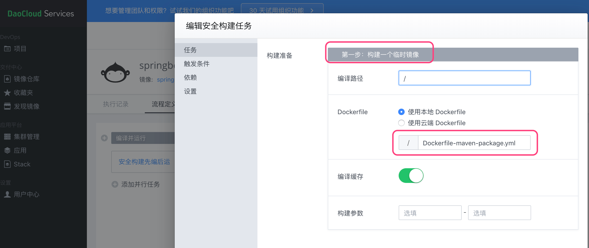

- **第二步**： 提取上一步的JAR包，并用JAVA运行。其中文件提取填写``/workspace/target/springboot-docker-hello-world-0.1.0.jar``，它与``Dockerfile-maven-package.yml``文件中的描述必须吻合。

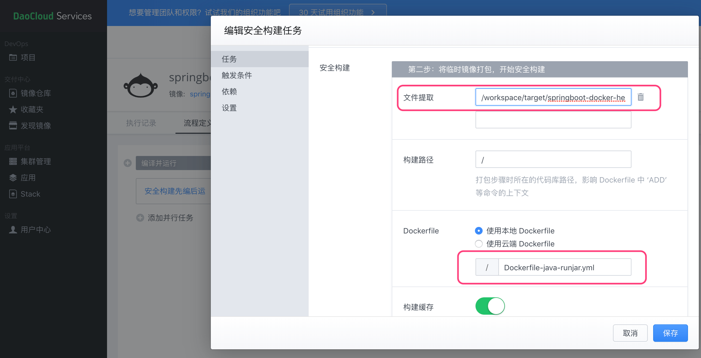


### Devops-pipeline-daocloud.yml


上述``可视化``界面就是辅助的生成了``Devops-pipeline-daocloud.yml``文件，它是``工作流``的等效描述：


``` yml

version: 3
stages:
- 编译并运行
安全构建先编后运:
  stage: 编译并运行
  job_type: lite_image_build
  only:
    branches:
    - .*
    tags:
    - .*
  allow_failure: false
  compile:
    build_dir: /
    cache: true
    dockerfile_path: /Dockerfile-maven-package.yml
  extract:
  - /workspace/target/springboot-docker-hello-world-0.1.0.jar
  package:
    build_dir: /
    cache: true
    dockerfile_path: /Dockerfile-java-runjar.yml

```


**温馨提醒**： 整个Pipeline，只有1个Stage；这个Stage里也只有1个Job。这个Job的类型是``job_type: lite_image_build``，它可以有两个步骤，并在第二步里有``extract``关键字，取值是``/workspace/target/springboot-docker-hello-world-0.1.0.jar``，表示从上一步提取JAR。


整体Pipeline可视化展示：

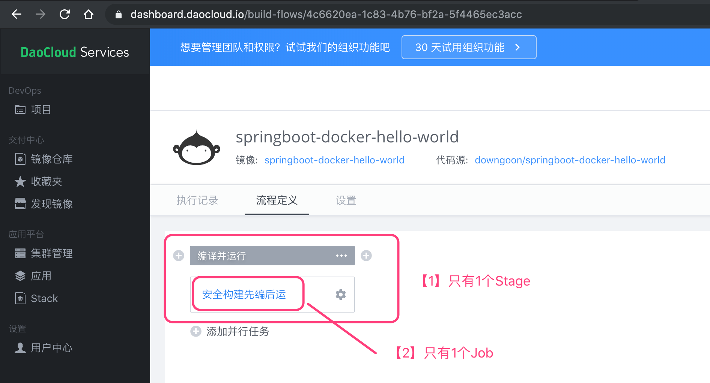


### Dockerfile-maven-package.yml


``` yml

FROM maven:3.5.0-jdk-8-alpine

MAINTAINER "downgoon@qq.com"

WORKDIR /workspace
ADD . /workspace

RUN mvn clean package -Dmaven.test.skip=true
CMD ["mvn"]

```


### Dockerfile-java-runjar.yml


``` yml

FROM java

MAINTAINER "downgoon@qq.com"

COPY /workspace/target/springboot-docker-hello-world-0.1.0.jar /usr/src/myapp/hello-world.jar

WORKDIR /usr/src/myapp/

ENTRYPOINT java -jar hello-world.jar

```


### Pipeline 执行结果


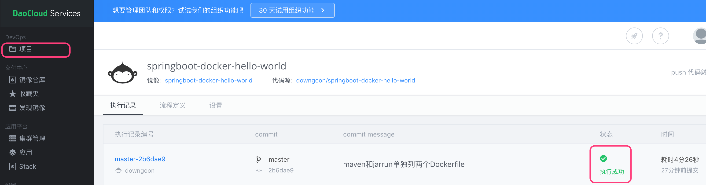


可以点击查看执行日志：[安全构建先编后运.log.zip](https://github.com/downgoon/springboot-docker-hello-world/files/3645799/log.zip)

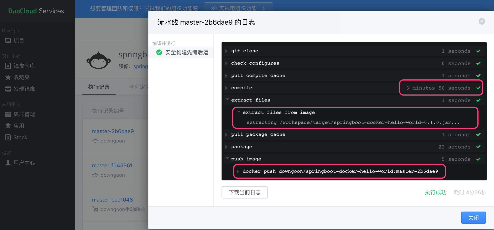

从日志可以清楚的观察到：

1. **耗时最长**： 耗时最长的环节是``mvn clean package``的执行，因为它要下载很多依赖包。
2. **提取JAR**： 下一环节运行前，需要从上一环节中提取生成的JAR包。
3. **发布镜像**： 将整个应用生成为``downgoon/springboot-docker-hello-world``镜像，版本号是``git push``时的``commit-id``，并发布到 [daocloud.io](https://daocloud.io) 的社区镜像中心，以便后续运行。


此时我们就可以在”镜像仓库“中找到刚发布的镜像了：

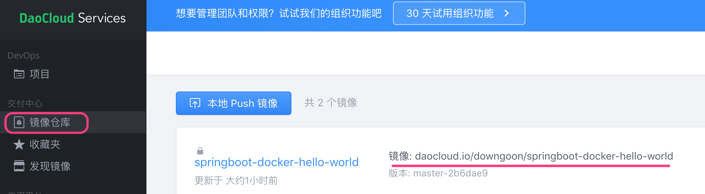


### 应用运行——把镜像运行在集群上

在镜像列表里，点击「部署最新版本」：

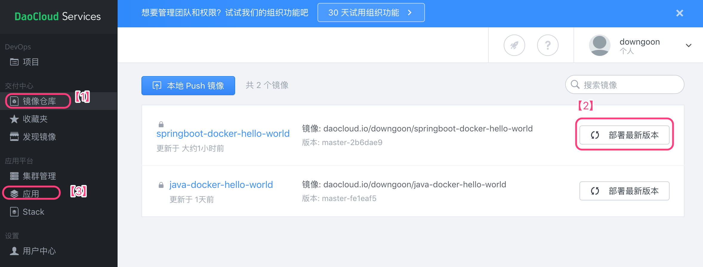


- **集群资源**： 为了让镜像运行在集群上，我们首先得有个集群资源。当然DaoCloud免费为大家提供体验性的集群，就一个主机，而且12小时候自动回收，当然后面还可以申请。官方把这种体验性的集群叫``胶囊``。

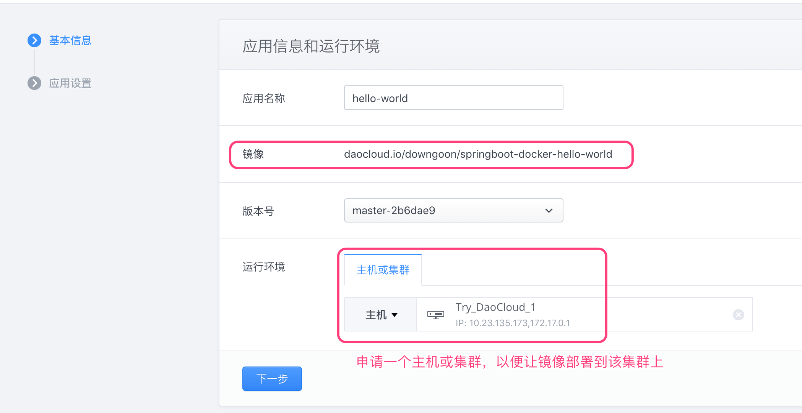

- **应用设置**： 这步骤很关键！否则应用即使启动了，也访问不了！我们能做三件事：

  - **端口映射**： 还记得``docker run -p 18080:8080 springboot-docker-hello-world``时的端口映射吗？
  - **磁盘挂载**： 还记得``docker run -v /host/path:/container/path nginx``时的磁盘挂载吗？
  - **环境变量**： 可以自定义设置。

  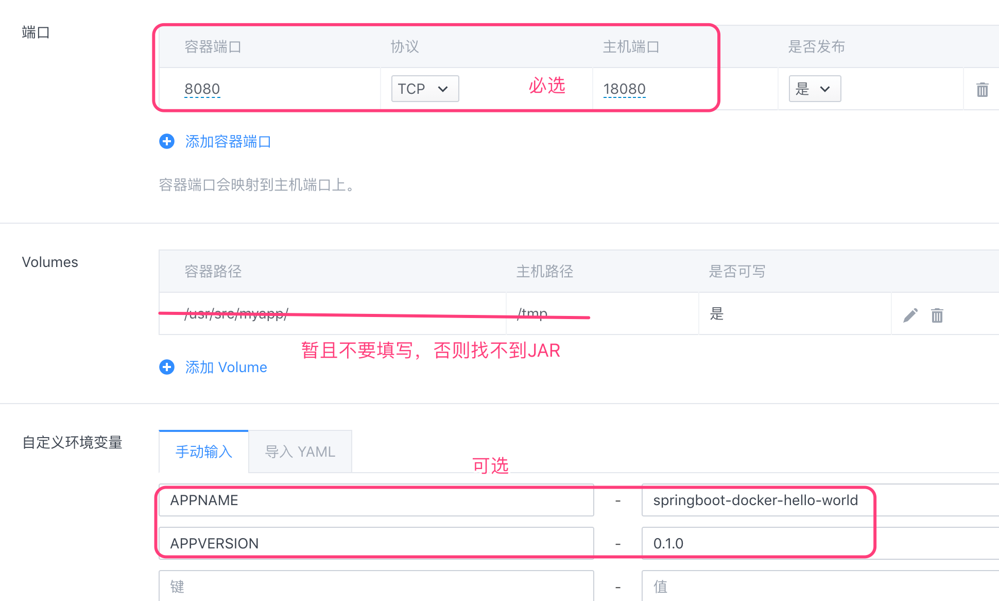


- **应用运行状况**： DaoCloud对于“胶囊”集群，没有外网IP，只有宿主机的内网IP。通常诸如[网易云](https://c.163.com)都会有一个``Load Balancer``，它负责将外网IP映射到容器集群的内网IP。

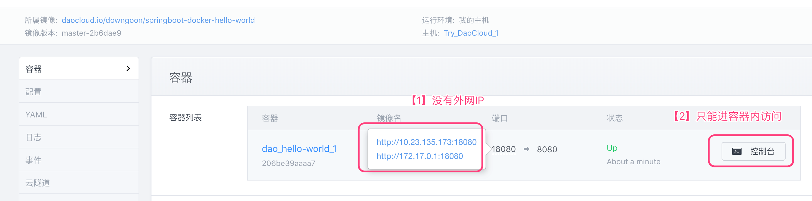

 在线登录控制台，可以访问RESTful服务：

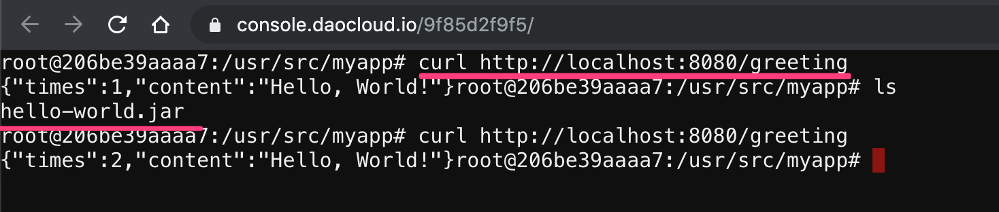

我们还可以勾选「自动发布」，以便当我们``git push``的时候，除了自动触发重新构建Docker Image，还能自动重新部署（当然我们这里没有LB，重新部署的时候对外服务会中断）。

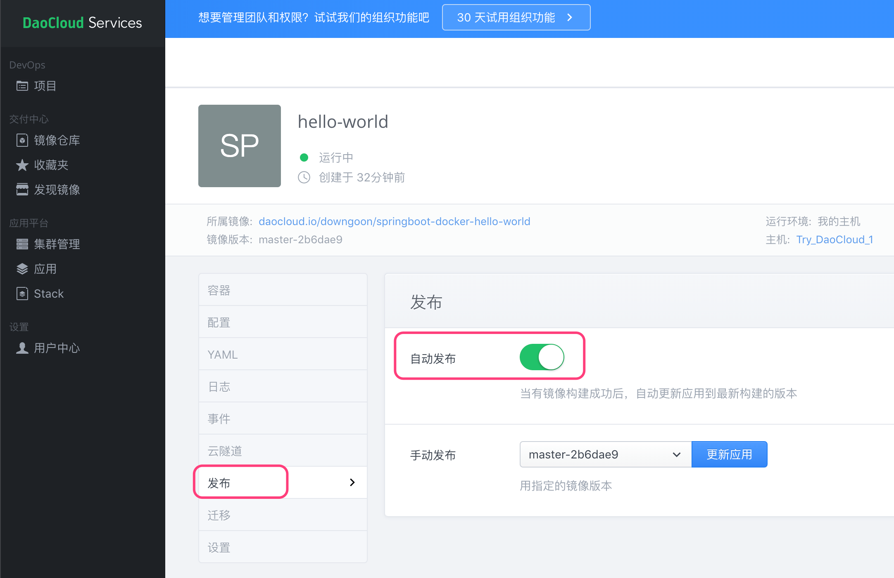


- **Dockerfile-k8s-daocloud.yml**:  最后，补充下上述GUI界面辅助生成的``Dockerfile-k8s-daocloud.yml``文件，当K8S的集群管理器收到该文件后，就会自动部署应用。


``` yml

hello-world:
  image: daocloud.io/downgoon/springboot-docker-hello-world:master-2b6dae9
  privileged: false
  restart: always
  ports:
  - 18080:8080
  environment:
  - APPVERSION=0.1.0
  - APPNAME=springboot-docker-hello-world

```


## 在阿里云上运行


阿里云构建Docker镜像，只能使用一个Dockerfile，无法像DaoCloud那样使用Pipeline串联起多个Dockerfile的模式。因此需要把``mvn clean package``和``java -jar hello-world.jar``两个合并到一起。尽管按道理应用程序运行只需要JRE环境即可，但是合并在一起，就得在镜像里还安装JDK和Maven，而且编译过程中还会从远程下载很多依赖库，致使应用镜像的Size会很大。


合并到一起的Dockerfile是``Dockerfile-Maven-And-Run.yml``，内容：


``` yml

FROM maven:3.5.0-jdk-8-alpine

MAINTAINER "downgoon@qq.com"

WORKDIR /workspace
ADD . /workspace

RUN mvn clean package -Dmaven.test.skip=true

# NO COPY COMMAND FOR ALIYUN.COM
# https://cr.console.aliyun.com/repository/cn-beijing/downgoon/springboot-docker-hello-world/build

# COPY /workspace/target/springboot-docker-hello-world-0.1.0.jar hello-world.jar
# ENTRYPOINT java -jar hello-world.jar

ENTRYPOINT java -jar target/springboot-docker-hello-world-0.1.0.jar

```


- 在本机制作镜像：

``` bash

$ docker build . -f Dockerfile-Maven-And-Run.yml -t springboot-docker-hello-world:justone

$ docker images
REPOSITORY                                     TAG                  IMAGE ID            CREATED             SIZE
springboot-docker-hello-world                  justone              63c6c96aa45f        9 minutes ago       156MB

```

- 运行镜像

``` bash

$ docker run -p 18080:8080 springboot-docker-hello-world:justone

```


## 参考资料

- [Spring Guides: Building a RESTful Web Service](https://spring.io/guides/gs/rest-service/)
- [DaoCloud: 在新流水线使用 Java 应用演示](http://guide.daocloud.io/dcs/java-12004750.html)
- [A Start to Finish Guide to Docker with Java](https://stackify.com/guide-docker-java/#wpautbox_latest-post)tt
